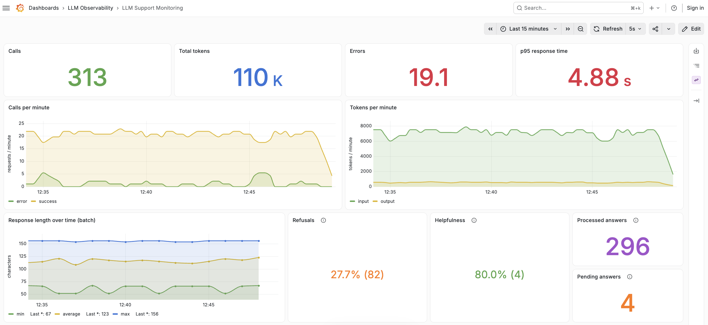

# LLM Support Monitoring

A small LLM support assistant instrumented with:

- Prometheus for calls, errors, token usage, and response time;
- PostgreSQL for batch-computed response length, refusals, and helpfulness;
- OpenTelemetry and Tempo for raw LLM traces;
- Grafana for a single dashboard across all three data sources.

## Start in mock mode

Mock mode does not require an API key. The load generator repeats the question set
until the containers are stopped.

```bash
cp .env.example .env
docker compose up --build
```

Open:

- Grafana dashboard: <http://localhost:3000/d/llm-support-monitoring>
- Swagger UI: <http://localhost:8000/docs>
- Prometheus: <http://localhost:9090>


Real-time metrics appear within a few seconds. The batch worker runs every 15
seconds by default, so batch metrics appear slightly later.

## Start with the OpenAI API

Set the API key and models in `.env`:

```text
OPENAI_API_KEY=your-key
OPENAI_MODEL=gpt-6-astra
# Optional: use a separate model for the helpfulness judge
OPENAI_JUDGE_MODEL=
```

Start Compose with the LLM override:

```bash
docker compose -f docker-compose.yml -f docker-compose.llm.yml up --build
```

In this mode, the load generator asks every question once and then exits. An
`Exited (0)` status for `loadgen` is expected; the application, batch worker,
databases, and Grafana continue running.

To repeat the question set continuously in LLM mode:

```bash
LOADGEN_REPEAT=true docker compose -f docker-compose.yml -f docker-compose.llm.yml up --build
```

Each successful interaction in LLM mode makes one model call for the answer and
another for the helpfulness judge. Continuous mode therefore keeps consuming API
quota until it is stopped.

## Configuration

- `LOADGEN_REPEAT=true|false` controls whether the question set repeats. Its
  default is `true` in mock mode and `false` in LLM mode.
- `LOADGEN_INTERVAL_SECONDS=2` sets the delay between requests.
- `ERROR_PROBABILITY=0.08` controls simulated request failures. Set it to `0` to
  disable them.
- `BATCH_INTERVAL_SECONDS=15` sets the batch evaluation interval.
- `OPENAI_MODEL` selects the assistant model.
- `OPENAI_JUDGE_MODEL` optionally selects a different helpfulness judge model.

Values can be set in `.env` or supplied before the Compose command.

## Send a request manually

```bash
curl -X POST http://localhost:8000/chat \
  -H "Content-Type: application/json" \
  -d '{"question": "Can I return an item after 20 days?"}'
```

The response includes a `trace_id`. Open the trace from the dashboard's recent
traces table or through **Grafana → Explore → Tempo**. The `llm.call` span contains
the `llm.question` and `llm.answer` attributes.

User text is stored in traces for visibility. In a production system, redact or
mask sensitive data before exporting traces.

## Stop or reset

Stop the containers while preserving all stored data:

```bash
docker compose down
```

Delete PostgreSQL rows, Prometheus metrics, Tempo traces, and Grafana state:

```bash
docker compose down -v --remove-orphans
```

Run either start command again to begin with empty metrics and traces. This reset
is also the intended way to apply database schema changes; the project does not
include migrations.

## Data flow

```text
loadgen ──> app ──> PostgreSQL <── batch
              ├──> /metrics <── Prometheus
              └──> OTLP traces ──> Tempo

Grafana reads Prometheus + PostgreSQL + Tempo
```

## Dashboard metrics

Response length is the answer length in characters. Refusals are detected with a
short regular expression over the stored answer. Both calculations are identical
in mock and LLM modes.

Helpfulness is mode-dependent. It is `NA` in mock mode. In LLM mode, the batch
worker asks an LLM judge to label each successful answer as `helpful` or
`not-helpful`.

The **Refusals** and **Helpfulness** cards use `rate (matching count)`. For example,
`27.8% (81)` means that 81 answers were refusals. Mock rows with helpfulness `NA`
are excluded from the Helpfulness denominator.

**Processed answers** counts successful answers already handled by the batch
worker in the selected time range. **Pending answers** counts successful answers
that have not been processed yet.
